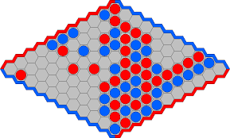

# HEX Player 🎮

Autonomous AI player for the HEX board game — University AI Project.



## What is HEX?

HEX is a two-player strategy game on an NxN hexagonal grid.

- **Player 1 🔴** connects left side to right side
- **Player 2 🔵** connects top side to bottom side

No draws are possible. The first player to connect their sides wins.

## Strategy

This player uses **Monte Carlo Tree Search (MCTS)** with UCB1 selection
to decide the best move within a 4.5 second time budget.

## Project Structure

```text
hex-player/
├── src/Urrutia_Dario_Alfonso/
│   ├── solution.py        ← SmartPlayer (MCTS)  [your code]
│   ├── board.py           ← HexBoard class       [provided by professors]
│   └── player.py          ← Base Player class    [provided by professors]
├── tests/                 ← pytest test suite
├── .github/workflows/     ← CI pipeline
├── Dockerfile             ← reproducible environment
├── .pre-commit-config.yaml← auto-lint on commit
├── .gitignore             ← ignored files
├── README.md              ← this file
└── pyproject.toml         ← project config & dependencies
```

### Submission Format (as required by professors)

```text
Urrutia_Dario_Alfonso/
├── solution.py            ← SmartPlayer (MCTS)
├── requirements.txt       ← only if external libraries are used
└── estrategia.pdf         ← technical explanation of the strategy
```

## Running Locally

```bash
python3 -m venv .venv
source .venv/bin/activate
pip install -e ".[dev]"
pytest
```

## Running with Docker

```bash
docker build -t hex-player .
docker run hex-player
```
